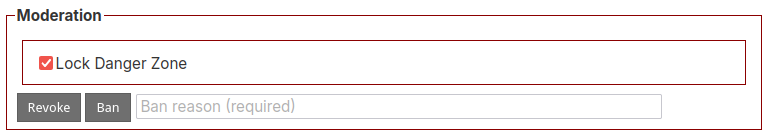
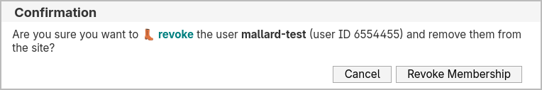

## "Easy Ban" User Script

The workflows to revoke and ban in Wikidot are unintuitive and annoying.

For revokes, the fastest approach is to have someone submit a "user report", go to the abuse section and kick them that way.

For bans, you can either use the above, but this does not let you add a ban reason. So the alternative is to open the ban creation form, which has an extremely poorly-optimized user search with annoying UI properties. This means that this encourages not documenting bans, or requires suffering through a terrible UX experience every time.

Thankfully, the actual ban call itself is comparatively simple, so as long as you have the user ID (which you can get from, for instance, the [More User Info](https://github.com/scpwiki/user-info-script) userscript), then this process can be greatly improved. That's what this script enables.

### How to Use

On the [site user profile page](https://scp-wiki.wikidot.com/system:user/mallard-test), a new section called "moderation" will be added:

This is disabled by default as a safety measure. By unchecking the checkbox, you can unlock the actions within:

You are **required** to enter a ban reason.

Per SCP Wiki administrative guidelines, you should give a summary of the ban (e.g. vandalism), provide an O5 link, and, if the ban is temporary, note the end date in the `15 May 2025` format.

Then click the action and a final confirmation will appear:

After carefully verifying that all the information is correct, then click the button to add the ban. Note that this will remove the user's membership if they're still a member.

Similarly for revokes:

### Installation

**You can [install the script](https://github.com/scpwiki/easy-ban-script/raw/main/easy-ban.user.js) here.**

Available under the MIT License.
